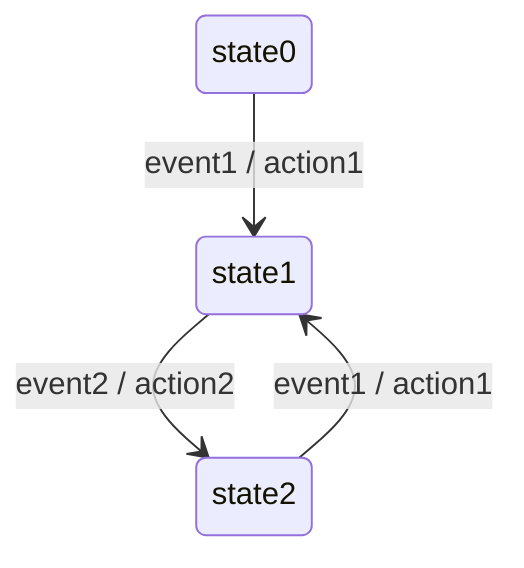
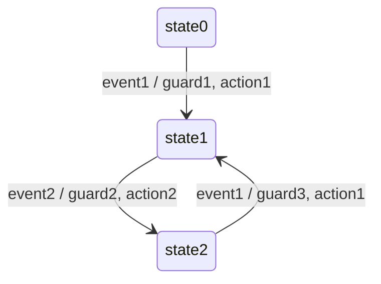

# StateMachine

[](https://github.com/xorz57/StateMachine/actions/workflows/Build.yml)

## What is a state machine?

A state machine is a computational model used to design systems that can be in one of a finite number of states at any given time. It consists of a set of states, transitions between those states, and actions that occur as a result of those transitions. The machine begins in an initial state and changes states based on input or events, following predefined rules. State machines are useful for modeling behaviors in various fields such as software development, digital circuit design, and robotics, allowing for clear and organized representation of complex processes and decision logic.

## Examples

### Example 1



Here, we use the first implementation of our state machine to transition between states and perform actions.

```cpp
#include "StateMachine/StateMachine1.hpp"

#include <iostream>

enum class state {
    state0,
    state1,
    state2
};

enum class event {
    event1,
    event2
};

static std::string to_string(const state &state) {
    switch (state) {
        case state::state0:
            return "state0";
        case state::state1:
            return "state1";
        case state::state2:
            return "state2";
    }
    return "unknown";
}

namespace action {
    const auto action1 = []() { std::cout << "action1" << std::endl; };
    const auto action2 = []() { std::cout << "action2" << std::endl; };
}// namespace action

int main() {
    transition_table_t<state, event> tt{
            {{state::state0, event::event1}, {action::action1, state::state1}},
            {{state::state1, event::event2}, {action::action2, state::state2}},
            {{state::state2, event::event1}, {action::action1, state::state1}},
    };

    state_machine_t<state, event> sm(state::state0, tt);
    std::cout << to_string(sm.get_state()) << std::endl;

    sm.handle_event(event::event1);
    std::cout << to_string(sm.get_state()) << std::endl;

    sm.handle_event(event::event2);
    std::cout << to_string(sm.get_state()) << std::endl;

    sm.handle_event(event::event1);
    std::cout << to_string(sm.get_state()) << std::endl;

    return 0;
}
```

```console
state0
action1
state1
action2
state2
action1
state1
```

### Example 2


Here, we use the second implementation to add enter and leave actions, showing more advanced state transitions.

```cpp
#include "StateMachine/StateMachine2.hpp"

#include <iostream>

enum class state {
    state0,
    state1,
    state2
};

enum class event {
    event1,
    event2
};

static std::string to_string(const state &state) {
    switch (state) {
        case state::state0:
            return "state0";
        case state::state1:
            return "state1";
        case state::state2:
            return "state2";
    }
    return "unknown";
}

namespace action {
    const auto action1 = []() { std::cout << "action1" << std::endl; };
    const auto action2 = []() { std::cout << "action2" << std::endl; };
}// namespace action

int main() {
    transition_table_t<state, event> tt{
            {{state::state0, event::event1}, {action::action1, state::state1}},
            {{state::state1, event::event2}, {action::action2, state::state2}},
            {{state::state2, event::event1}, {action::action1, state::state1}},
    };

    state_machine_t<state, event> sm(state::state0, tt);
    std::cout << to_string(sm.get_state()) << std::endl;

    sm.set_enter_action(state::state1, []() { std::cout << "enter_action1" << std::endl; });
    sm.set_leave_action(state::state1, []() { std::cout << "leave_action1" << std::endl; });

    sm.handle_event(event::event1);
    std::cout << to_string(sm.get_state()) << std::endl;

    sm.handle_event(event::event2);
    std::cout << to_string(sm.get_state()) << std::endl;

    sm.handle_event(event::event1);
    std::cout << to_string(sm.get_state()) << std::endl;

    return 0;
}
```

```console
state0
action1
enter_action1
state1
leave_action1
action2
state2
action1
enter_action1
state1
```

### Example 3



Here, we use the third implementation to demonstrate the use of guards, which allow or prevent transitions based on conditions.

```cpp
#include "StateMachine/StateMachine3.hpp"

#include <iostream>

enum class state {
    state0,
    state1,
    state2
};

enum class event {
    event1,
    event2
};

static std::string to_string(const state &state) {
    switch (state) {
        case state::state0:
            return "state0";
        case state::state1:
            return "state1";
        case state::state2:
            return "state2";
    }
    return "unknown";
}

namespace action {
    const auto action1 = []() { std::cout << "action1" << std::endl; };
    const auto action2 = []() { std::cout << "action2" << std::endl; };
}// namespace action

namespace guard {
    const auto guard1 = []() { return true; };
    const auto guard2 = []() { return true; };
    const auto guard3 = []() { return false; };
}// namespace guard

int main() {
    transition_table_t<state, event> tt{
            {{state::state0, event::event1}, {guard::guard1, action::action1, state::state1}},
            {{state::state1, event::event2}, {guard::guard2, action::action2, state::state2}},
            {{state::state2, event::event1}, {guard::guard3, action::action1, state::state1}},
    };

    state_machine_t<state, event> sm(state::state0, tt);
    std::cout << to_string(sm.get_state()) << std::endl;

    sm.set_enter_action(state::state1, []() { std::cout << "enter_action1" << std::endl; });
    sm.set_leave_action(state::state1, []() { std::cout << "leave_action1" << std::endl; });

    sm.handle_event(event::event1);
    std::cout << to_string(sm.get_state()) << std::endl;

    sm.handle_event(event::event2);
    std::cout << to_string(sm.get_state()) << std::endl;

    sm.handle_event(event::event1);
    std::cout << to_string(sm.get_state()) << std::endl;

    return 0;
}
```

```console
state0
action1
enter_action1
state1
leave_action1
action2
state2
state2
```

## How to Build

#### Linux & macOS

```bash
git clone https://github.com/microsoft/vcpkg.git ~/vcpkg
~/vcpkg/bootstrap-vcpkg.sh

git clone https://github.com/xorz57/StateMachine.git
cd StateMachine
cmake -B build -DCMAKE_BUILD_TYPE=Release -S . -DCMAKE_TOOLCHAIN_FILE=~/vcpkg/scripts/buildsystems/vcpkg.cmake
cmake --build build --config Release
ctest --build-config Release
```

#### Windows

```powershell
git clone https://github.com/microsoft/vcpkg.git C:/vcpkg
C:/vcpkg/bootstrap-vcpkg.bat
C:/vcpkg/vcpkg.exe integrate install

git clone https://github.com/xorz57/StateMachine.git
cd StateMachine
cmake -B build -DCMAKE_BUILD_TYPE=Release -S . -DCMAKE_TOOLCHAIN_FILE=C:/vcpkg/scripts/buildsystems/vcpkg.cmake
cmake --build build --config Release
ctest --build-config Release
```

## Stargazers over time

[](https://starchart.cc/xorz57/StateMachine)
