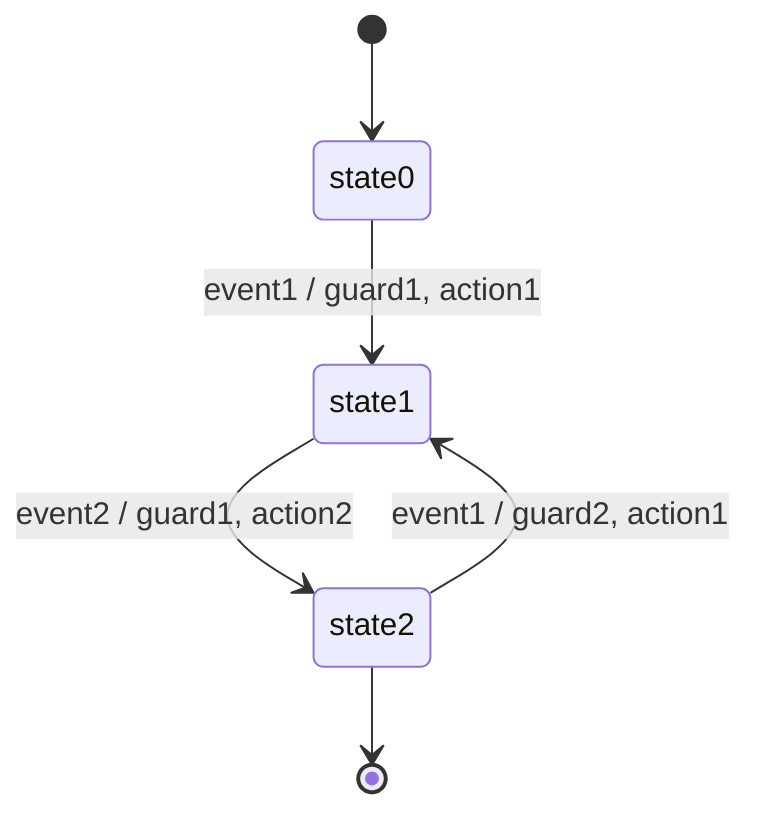

# StateMachine



```cpp
#include "StateMachine.hpp"

#include <iostream>

enum class state {
    state0,
    state1,
    state2
};

enum class event {
    event1,
    event2
};

static std::string to_string(const state &state) {
    switch (state) {
        case state::state0:
            return "state0";
        case state::state1:
            return "state1";
        case state::state2:
            return "state2";
    }
    return "unknown";
}

static std::string to_string(const event &event) {
    switch (event) {
        case event::event1:
            return "event1";
        case event::event2:
            return "event2";
    }
    return "unknown";
}

int main() {
    const auto action1 = []() { std::cout << "action1" << std::endl; };
    const auto action2 = []() { std::cout << "action2" << std::endl; };

    const auto guard1 = []() { return true; };
    const auto guard2 = []() { return true; };
    const auto guard3 = []() { return false; };

    xorz57::transition_table_t<state, event> tt{
            {{state::state0, event::event1}, {guard1, action1, state::state1}},
            {{state::state1, event::event2}, {guard2, action2, state::state2}},
            {{state::state2, event::event1}, {guard3, action1, state::state1}},
    };

    xorz57::state_machine_t<state, event> sm(state::state0, tt);
    std::cout << to_string(sm.get_state()) << std::endl;

    sm.handle_event(event::event1);
    std::cout << to_string(sm.get_state()) << std::endl;

    sm.handle_event(event::event2);
    std::cout << to_string(sm.get_state()) << std::endl;

    sm.handle_event(event::event1);
    std::cout << to_string(sm.get_state()) << std::endl;

    return 0;
}
```

```console
state0
action1
state1
action2
state2
state2
```
